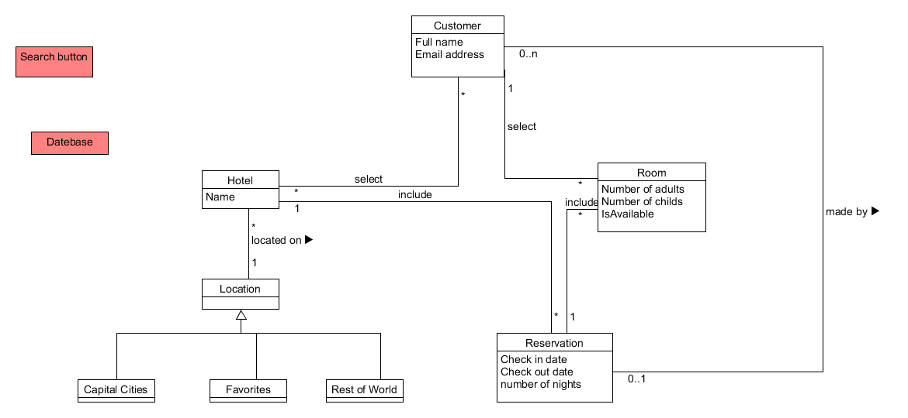
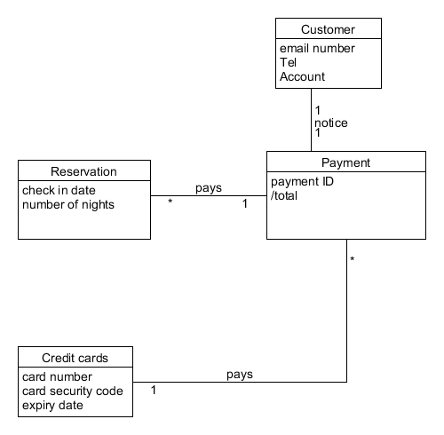
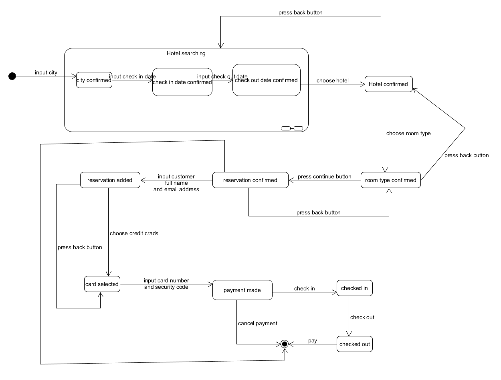

---
16340320
庄铸滔

---

1、使用类图，分别对 Asg_RH 文档中 Make Reservation 用例以及 Payment 用例开展领域建模。然后，根据上述模型，给出建议的数据表以及主要字段，特别是主键和外键

- 注意事项：
  - 对象必须是名词、特别是技术名词、报表、描述类的处理；
  - 关联必须有多重性、部分有名称与导航方向
  - 属性要注意计算字段
- 数据建模，为了简化描述仅需要给出表清单，例如：
  - Hotel（ID/Key，Name，LoctionID/Fkey，Address…..）

## reservation

## payment

## 建议的数据库表字段

1. reservation库

   Customer: ID/Key, Full name, email address

   Hotel: name, location/FKey

   Room: ID/key, Number of adults, number of childs, isAvailable, ReservationID/FKey

   Reservation: ID/Key, check in date, check out date, number of nights

2. payment 字段

   Customer: Account/Key,  Tel, email

   Payment: payment ID/ Key, total, Reservation ID/FKey, Credit card number/FKey

   Reservation: Reservation ID/Key, check in date, check out date, number of nights

   Credit cards:card number/Key, expiry date

2、使用 UML State Model，对每个订单对象生命周期建模

- 建模对象： 参考 Asg_RH 文档， 对 Reservation/Order 对象建模。
- 建模要求： 参考练习不能提供足够信息帮助你对订单对象建模，请参考现在 定旅馆 的旅游网站，尽可能分析围绕订单发生的各种情况，直到订单通过销售事件（柜台销售）结束订单。

状态图包含以下几个部分

1. 搜索酒店，这里面包含三个子状态确认城市，确认入住时间，确认退房时间
2. 选择酒店
3. 选择房间
4. 生成订单
5. 生成支付条项
6. 入住
7. 退房
8. 付款

